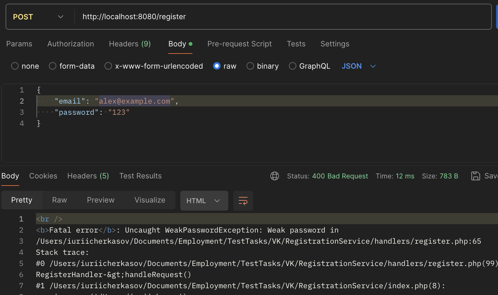
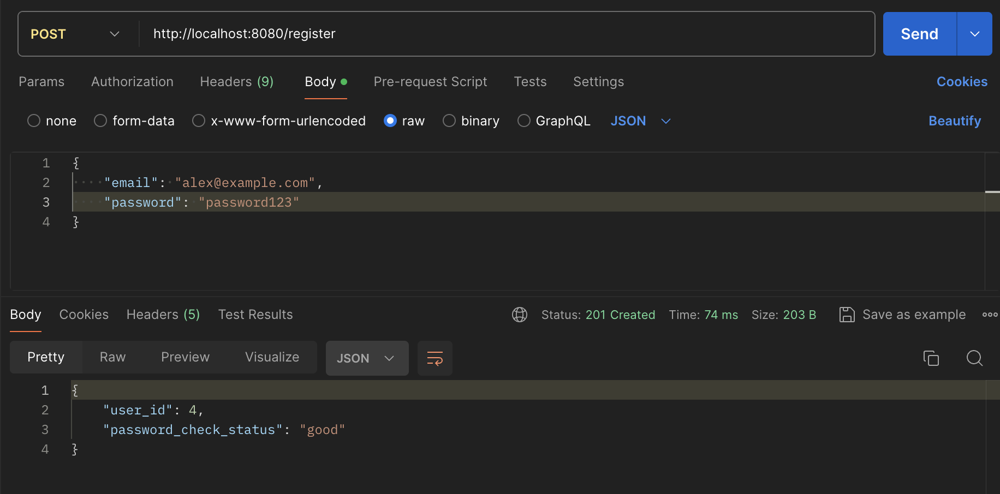
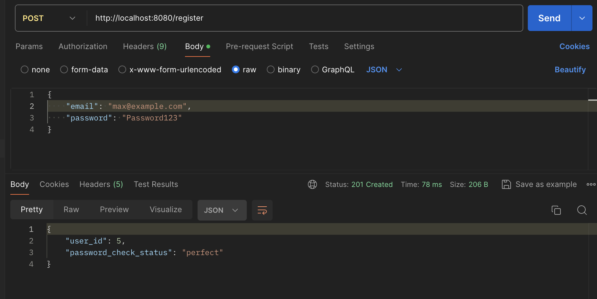
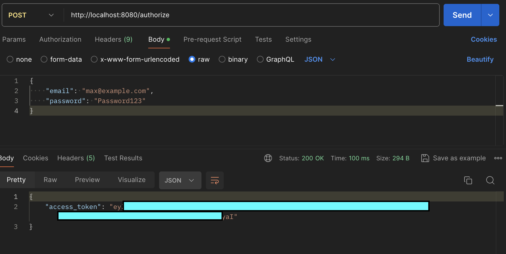
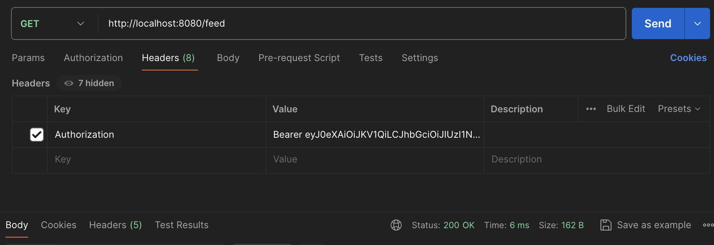
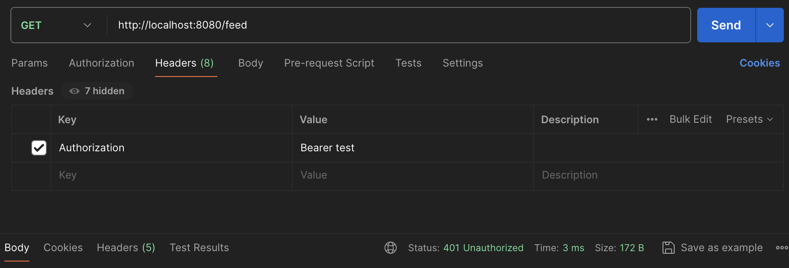

# RegistrationService
Test task for VK 

## Установка
```bash
composer install
```

## Запуск
```bash
make
```

После запуска нужно направить POST запрос на [http://localhost:8080/register](http://localhost:8080/register) с телом:
```json
{
    "email": "email",
    "password": "password"
}
```

Если пароль слишком слабый, то будет проброшенно исключение `WeakPasswordException`:



Идеальный пароль должен содержать цифры, строчные и прописные буквы. Если все 3 условия проходят, то пароль получит статус `perfect`, иначе `good`:

  

  

Для авторизации нужно направить POST запрос на [http://localhost:8080/authorize](http://localhost:8080/authorize) с телом:
```json
{
    "email": "email",
    "password": "password"
}
```



В ответ будет получен токен, который нужно указывать в заголовке `Authorization` при выполнении GET запроса на [http://localhost:8080/feed](http://localhost:8080/feed):



В случае успеха будет получен ответ со статусом `200 OK`, в случае ошибки будет получен ответ со статусом `401 Unauthorized`.

